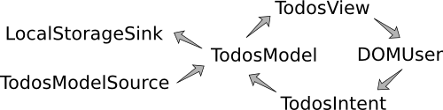

TodoMVC in Cycle.js
===================

TodoMVC example implemented in [Cycle.js](https://github.com/staltz/cycle).

[Open the app](http://staltz.com/todomvc-cycle)

## Injection Flow
This is how the various [DataFlowNode](https://github.com/staltz/cycle/blob/master/docs/data-flow-nodes.md)s interact with each other. Note that this is just one of many possible arrangements of DataFlowNodes. Cycle isn't opinionated about that.

